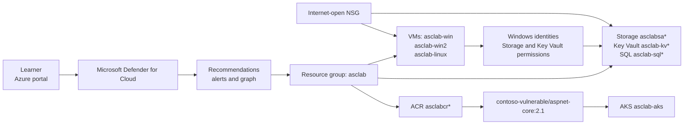

# Getting Started: Secure Your Azure Workloads with Microsoft Defender for Cloud

## Scenario

Contoso operates a deliberately vulnerable Azure workload in `eastus`. You are the security owner for one Azure subscription and will use Microsoft Defender for Cloud as the control plane for an investigate-first, then-remediate workflow. The environment was assessed for 48 hours before this lab, so Defender CSPM, Defender for Servers Plan 2, agentless machine scanning, the cloud security graph, and baseline recommendations are available.

## Lab overview

Complete six challenges in order: establish a baseline; remediate storage, SQL, and Key Vault; enable workload plans and triage sample alerts; investigate the fixed vulnerable container image; configure JIT and interpret agentless results; then automate recommendations, remediate the attack-path recommendation, and export compliance evidence.

## Sign in

1. Open <https://portal.azure.com>.
2. Sign in with:
   - **User name:** <inject key="AzureAdUserEmail"></inject>
   - **Password:** <inject key="AzureAdUserPassword"></inject>
3. Confirm subscription <inject key="SubscriptionID"></inject> and tenant <inject key="TenantID"></inject>.
4. Work only in the Azure portal. Owner access to one subscription is required. No workstation software, Docker, external service, DevOps organization, connector, AWS, GCP, Microsoft 365, Purview, Defender XDR, Copilot, or DevTestLab schedule is required.

## Learning objectives

- Establish a Defender for Cloud baseline without requiring score movement.
- Remediate storage, SQL, and Key Vault settings and create **Contoso Secure Workload Baseline**.
- Enable Storage, Key Vault, SQL, and Containers protection and triage exact sample-alert strings.
- Analyze `contoso-vulnerable/aspnet-core:2.1` from source `mcr.microsoft.com/dotnet/core/aspnet:2.1` in `asclabcr*` and `asclab-aks`.
- Configure JIT for ports `3389` and `22` with maximum `PT3H`, source `Any`, and request `PT15M`.
- Create recommendation-only automation, verify a healthy attack-path recommendation, and export MCSB CSV evidence.

## Architecture

The workload is intentionally exposed so you can investigate before remediation.

## Components and pinned values

| Component | Value |
|---|---|
| Region | `eastus` |
| Workload resource group | `asclab` |
| Access resource group | `lab-vm`; jump box **labvm-<inject key="DeploymentID" enableCopy="false"/>** |
| VMs | `asclab-win`, `asclab-win2`, `asclab-linux` |
| Storage/container | `asclabsa*`, `asclab-public-container` |
| Key Vault | `asclab-kv*`, three secrets |
| SQL | `asclab-sql*`, `asclab-db` |
| Registry/cluster | `asclabcr*`, `asclab-aks` |
| Fixed image | `contoso-vulnerable/aspnet-core:2.1` |
| Source image | `mcr.microsoft.com/dotnet/core/aspnet:2.1` |
| Custom standard | `Contoso Secure Workload Baseline` |
| Standard member | `Storage accounts should restrict network access using virtual network rules`; definition ID `2a1a9cdf-e04d-429a-8416-3bfb72a1b26f` |
| JIT | `PT3H`, `Any`, learner request `PT15M` |
| Automation | `war-contoso-high-severity-recommendations` targeting `la-contoso-defender-recommendations`, recommendations only |
| Logic App | Trigger `When a Microsoft Defender for Cloud recommendation is created or triggered`; one `Compose` action |
| Compliance | Microsoft cloud security benchmark (MCSB), CSV |

MCSB is applied by default. Validation uses prescribed resource and configuration state, not secure-score values or attack-path disappearance.

## How to use this guide

Complete the challenges in order and run the validation marker at the end of each one. Record observations in your own notes. Recommendation freshness can vary; use the specified state and exact pinned values as the source of truth.

For support, contact: cloudlabs-support@spektrasystems.com

Live support is also available through [CloudLabs live chat](https://cloudlabs.ai/labs-support).

Happy Learning!

You have successfully completed the Hands-on Lab.
